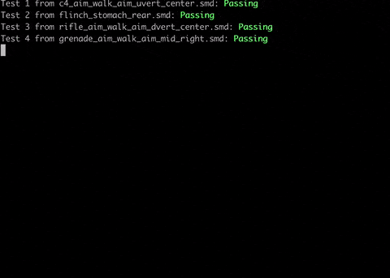

#

## Установка

Создаем вирутальное окружение в директории проекта и подключаемся к нему:

```bash
python3 -m venv venv
source venv/bin/activate
```

Устанавливаем необходимый модуль:

```bash
pip install build
```

Билдим python-приложение:

```bash
python -m build
```

Устанавливаем его в виртуальное окружение:

```bash
pip install dist/SMDTool-0.0.1-py3-none-any.whl
```

## Использование

Программе на вход необходимо подать путь до smd-файла, а при желании и адрес, куда будет сохранен бинарник (сериализованный python-объект):

```bash
smd-tool -o ./file.pickle ./file.smd
```

Но вообще, всегда можно вывести справку ;)

## Тестирование

Программа может прогонять все необходимые тесты, если запускать ее из директории, в которой находится папка из архивчика — "animset_t_anims":

```bash
smd-tool --testing .
```

...и проинформирует нас об их безупречном прохождении!

